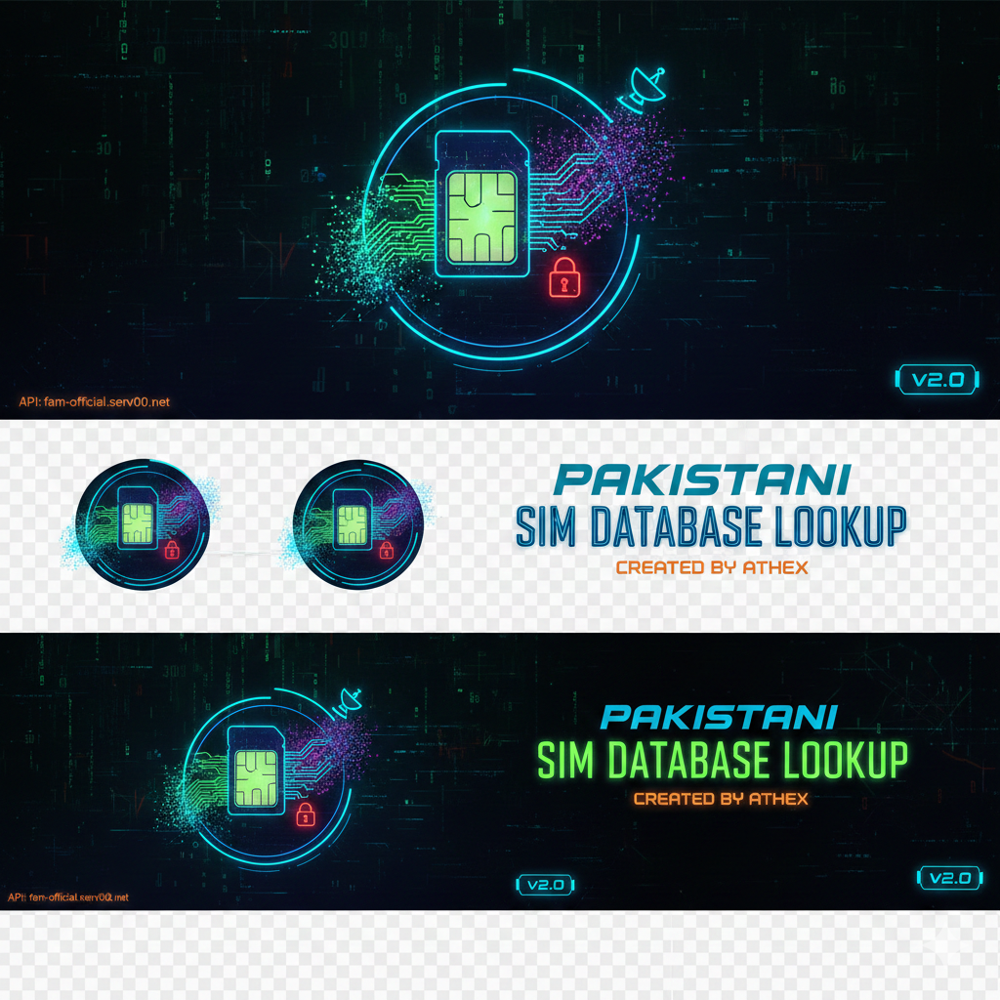

 

# 📡 Pakistani SIM Database Lookup Tool

***A cinematic terminal application with epic animations for querying Pakistani SIM database information through an API. Featuring Matrix-style effects, typewriter animations, and syntax-highlighted JSON display.***

# ✨ Features
**🎬 Visual Effects**
Matrix Rain Animation - Digital rain effect on startup

Multi-phase Banner - Layered ASCII art reveal with color transitions

Typewriter Text - Animated character-by-character display

Sparkle & Pulse Effects - Visual feedback animations

Color Cycling - Smooth gradient transitions

# 📊 Data Display
Animated Results - Dynamic data reveal with emoji icons

Syntax-Highlighted JSON - Color-coded raw API responses

Fancy JSON Boxes - Formatted JSON with animated borders

Interactive Prompts - Engaging user interface

# 🔧 Technical Features
API Integration - Query fam-official.serv00.net database

Error Handling - Graceful error recovery with animations

Input Validation - SIM number format checking

Multiple Display Modes - Choose between pretty and JSON views

# 🚀 Installation
Prerequisites
Python 3.8 or higher

requests library

Quick Install
bash
# Clone or download the script
git clone https://github.com/Athexhacker/SIM-DATA.git
cd SIM-DATA

# Install dependencies
pip install requests

# Make executable (Linux/Mac)
chmod +x run.py

# Run the script
python run.py

# 🎮 Usage
Basic Usage
Available Commands
Command	Description
3001234567	Query a SIM number
q	Quit the program
b	Replay banner animation
c	Clear screen
m	Show matrix rain effect
help	Show command list
Input Format
Enter Pakistani SIM numbers without the leading 0:

***✅ Correct: 3001234567, 3109876543***

**❌ Incorrect: 03001234567, abc123**

📸 Screenshots
Startup Animation
text

   █▀▀▀▀▀▀▀▀▀▀▀▀▀▀▀▀▀▀▀▀▀▀▀▀▀▀▀▀▀▀▀▀▀▀▀▀▀▀▀▀▀█   
   █  PAKISTANI SIM DATABASE LOOKUP SYSTEM   █   
   █▄▄▄▄▄▄▄▄▄▄▄▄▄▄▄▄▄▄▄▄▄▄▄▄▄▄▄▄▄▄▄▄▄▄▄▄▄▄▄▄▄█   
                                                     
         CREATED BY: ATHEX BLACK HAT TEAM                     
═══════════════════════════════════════════════════════
Results Display
***text***
▓▓▓ SIM DATABASE QUERY RESULTS ▓▓▓
┌─[📱 PHONE NUMBER]
│ 3001234567
├─[🕐 QUERY TIME]
│ 2024-01-20 14:30:45
├─[📊 STATUS]
│ ✅ QUERY SUCCESSFUL!
├─[📋 RETRIEVED DATA]
│ 📞 NUMBER: 3001234567
│ 🏢 NETWORK: Jazz
│ 📍 LOCATION: Lahore
│ 🏷️ STATUS: Active
│ 👤 NAME: xxxxxxxx
JSON Output
json
{
  "success": true,
  "number": "3001234567",
  "network": "Jazz",
  "location": "Lahore",
  "status": "Active",
  "name": "xxxxxxxx",
  "credit": "FAMOFC"
}
🛠️ API Integration
Endpoint
Response Format
json
{
  "success": boolean,
  "data_fields": "values",
  "error": "message if failed",
  "usage": "usage instructions",
  "credit": "API credits"
}

***📝 License***
This project is licensed under the MIT License - see the LICENSE file for details.

🙏 Acknowledgments
API Provider: fam-official

Creator: ATHEX BLACK HAT

Inspiration: Terminal animations and hacker aesthetics

Ensure you're using the latest version

Made with ❤️ by ATHEX BLACK HAT TEAM

"Information is power, but presentation is everything."

